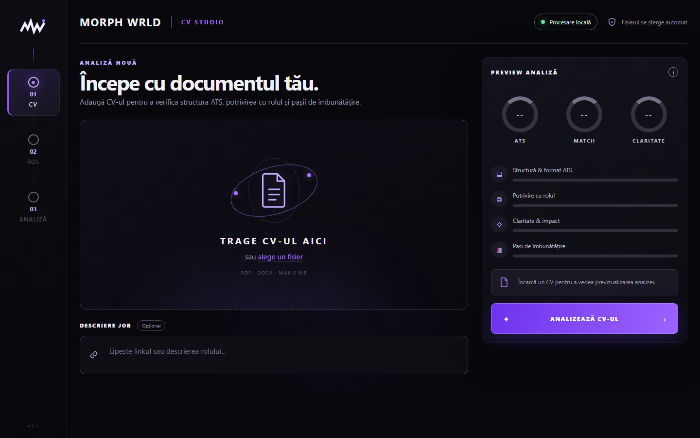
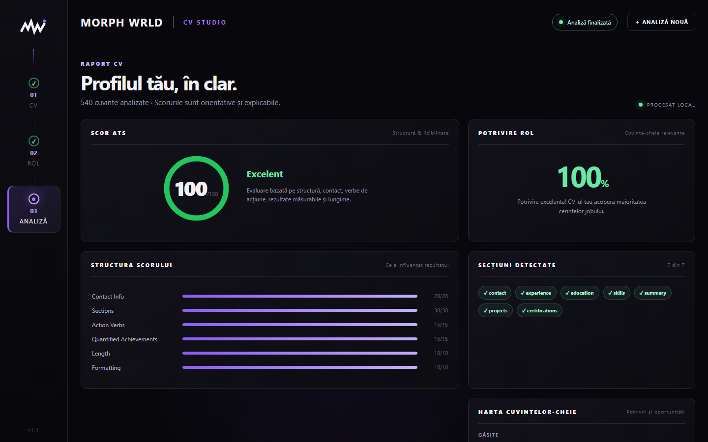
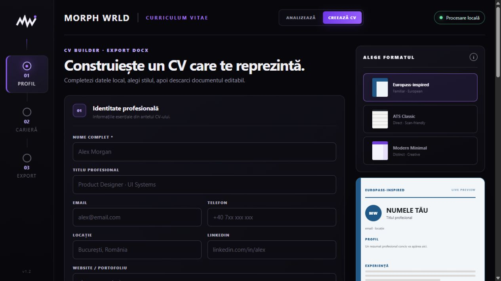

<p align="center">
  
</p>

<h1 align="center">MORPH WRLD — Curriculum Vitae</h1>

<p align="center">
  Local-first CV analysis and creation with transparent ATS scoring, editable DOCX export, and practical improvement suggestions.
</p>

MORPH WRLD Curriculum Vitae extracts text from PDF and DOCX documents, scores common ATS signals, compares the CV with an optional role description, and turns the result into a prioritized action plan. Its CV Builder also creates an editable DOCX from structured career information. No external AI service or account is required.

> Scores are heuristic guidance. They do not reproduce a specific employer's applicant-tracking system and are not hiring decisions.

## Interface

### New analysis



### Results dashboard



### CV Builder



## Highlights

- Clear ATS score with a visible category breakdown
- Optional job-description match and missing-keyword map
- Prioritized, practical improvement suggestions
- PDF and DOCX support, including text stored in DOCX tables
- Local processing with automatic temporary-file cleanup
- No external API or cloud upload
- Native Windows window powered by pywebview
- Built-in CV creator with repeatable experience and education sections
- Three editable DOCX styles: Europass-inspired, ATS Classic, and Modern Minimal
- Dedicated fields for language, digital, project, certification, and volunteering information

The Europass-inspired option follows the familiar information structure described by [Europass](https://europass.europa.eu/en/create-europass-cv), but it is an independent template and is not an official EU/Europass document.

## Run from source

Requires Python 3.10 or newer on Windows.

```powershell
python -m venv .venv
.venv\Scripts\python.exe -m pip install -r requirements.txt
.venv\Scripts\python.exe app.py
```

The desktop window starts an internal Flask server bound only to a random loopback port.

## Build the Windows executable

```powershell
.venv\Scripts\python.exe -m pip install -r requirements-build.txt
.\build.ps1
```

The executable is written to `dist\MW-Curriculum-Vitae.exe`.

## Tests

```powershell
.venv\Scripts\python.exe -m unittest discover -s tests -v
```

## Safety limits

- PDF and DOCX only, up to 5 MB per upload
- Up to 50 PDF pages
- Up to 50 MB uncompressed DOCX content
- Up to 500,000 extracted characters
- Up to 50,000 characters in a job description
